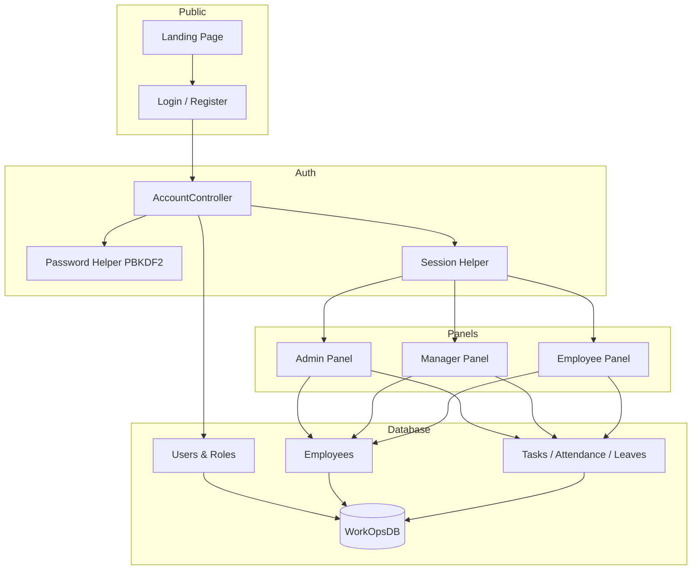

# WorkOps — Smart Company Management System

## 🚀 Overview

**WorkOps** is a comprehensive web-based workforce management system designed to streamline organizational operations. It centralizes employee management, attendance tracking, leave administration, task management, and reporting through dedicated role-based panels for **Admins**, **Managers**, and **Employees**.

The system is built to improve productivity, enhance collaboration, and provide a structured workflow within an organization.

---

## Table of Contents

- [Project Overview](#project-overview)
- [Technologies Used](#technologies-used)
- [System Requirements](#system-requirements)
- [Software Installation](#software-installation)
- [Project Structure](#project-structure)
- [Database Setup](#database-setup)
- [Connect Database to Application](#connect-database-to-application)
- [How to Run the Project](#how-to-run-the-project)
- [Default Login Credentials](#default-login-credentials)
- [Project Functionalities](#project-functionalities)
- [How the System Works](#how-the-system-works)
- [Screenshots](#screenshots)
- [Documentation](#documentation)
- [Configuration](#configuration)
- [Future Enhancements](#future-enhancements)
- [License & Author](#license--author)

---

## Project Overview

WorkOps helps organizations manage day-to-day workforce operations from a single platform:

- Admins configure departments, employees, holidays, and system settings.
- Managers oversee their team, assign tasks, and approve leave requests.
- Employees view tasks, mark attendance context, apply for leave, and manage their profile.

The application uses a modern, responsive UI with dark mode support, activity logging, in-app notifications, and role-based access control.

---

## Technologies Used

| Layer | Technology |
|--------|------------|
| **Backend** | ASP.NET MVC 5, C#, .NET Framework 4.8 |
| **ORM / Data** | Entity Framework 6 (Database First, EDMX) |
| **Database** | Microsoft SQL Server (Express or full edition) |
| **Frontend** | HTML5, CSS3, Bootstrap 5, JavaScript, jQuery |
| **Icons** | Lucide Icons, Font Awesome |
| **Authentication** | Session-based login, PBKDF2 password hashing |
| **Tools** | Visual Studio 2022, SQL Server Management Studio (SSMS) |

---

## System Requirements

| Component | Minimum |
|-----------|---------|
| **OS** | Windows 10 / 11 (64-bit) |
| **IDE** | Visual Studio 2022 (ASP.NET and web development workload) |
| **Runtime** | .NET Framework 4.8 Developer Pack |
| **Database** | SQL Server 2019+ or SQL Server Express |
| **RAM** | 8 GB recommended |
| **Browser** | Chrome, Edge, or Firefox (latest) |

---

## Software Installation

### 1. Install Visual Studio 2022

1. Download [Visual Studio 2022 Community](https://visualstudio.microsoft.com/downloads/) (free for students).
2. Run the installer and select these workloads:
   - **ASP.NET and web development**
   - **.NET desktop development** (optional but helpful)
3. Under **Individual components**, ensure these are checked:
   - **.NET Framework 4.8 targeting pack**
   - **.NET Framework 4.8 SDK**
4. Complete installation and restart if prompted.

### 2. Install SQL Server

1. Download [SQL Server Express](https://www.microsoft.com/en-us/sql-server/sql-server-downloads).
2. During setup, choose **Basic** or **Custom** installation.
3. Note your **instance name** (default is often `SQLEXPRESS`).
4. Use **Windows Authentication** during development.

### 3. Install SQL Server Management Studio (SSMS)

1. Download [SSMS](https://learn.microsoft.com/en-us/sql/ssms/download-sql-server-management-studio-ssms).
2. Install and open SSMS.
3. Connect using: `localhost\SQLEXPRESS` (or your instance name) with Windows Authentication.

---

## Project Structure

```
WorkOps/
├── Database.sql                 # Full SQL script to create WorkOpsDB
├── README.md                    # This file
├── .gitignore                   # Files excluded from Git
├── WorkOps.slnx                 # Visual Studio solution file
├── WorkOps/                     # Main ASP.NET MVC application
│   ├── Controllers/             # MVC controllers (Admin, Manager, Employee panels)
│   ├── Models/                  # View models & Entity Framework models
│   ├── Views/                   # Razor views (.cshtml)
│   ├── Content/css/             # Stylesheets (modern UI theme)
│   ├── Scripts/                 # JavaScript files
│   ├── Helpers/                 # Password, session, notification helpers
│   ├── Filters/                 # Authorization filters
│   ├── App_Data/                # Uploaded files (profile pictures, etc.)
│   └── Web.config               # App & database connection settings
├── WorkOps Images/              # GUI screenshots for documentation
└── Workops Documents/           # PDF documentation (project, DB, user manual)
```

---

## Database Setup

The complete database schema, stored procedures, seed data, and sample records are in **`Database.sql`** at the project root.

### Steps to create the database

1. Open **SQL Server Management Studio (SSMS)**.
2. Connect to your SQL Server instance (e.g. `localhost\SQLEXPRESS`).
3. Go to **File → Open → File** and select `Database.sql`.
4. Review the script header — it creates database **`WorkOpsDB`**.
5. Click **Execute** (or press `F5`) and wait until the script completes successfully.
6. In Object Explorer, refresh **Databases** — you should see **WorkOpsDB** with tables such as:
   - `Users`, `Roles`, `Employees`, `Departments`
   - `Attendance`, `Leaves`, `Tasks`, `Holidays`
   - `Notifications`, `ActivityLogs`, and more

> **Note:** Running the script drops and recreates `WorkOpsDB` if it already exists. Back up any data before re-running.

---

## Connect Database to Application

After creating the database, point the MVC project to your SQL Server instance.

1. Open **`WorkOps/Web.config`** in Visual Studio.
2. Find the `<connectionStrings>` section near the bottom.
3. Update the `data source` to match your SQL Server instance:

```xml
<connectionStrings>
  <add name="WorkOpsDBEntities"
       connectionString="metadata=res://*/Models.WorkOpsModel.csdl|res://*/Models.WorkOpsModel.ssdl|res://*/Models.WorkOpsModel.msl;provider=System.Data.SqlClient;provider connection string=&quot;data source=localhost\SQLEXPRESS;initial catalog=WorkOpsDB;integrated security=True;MultipleActiveResultSets=True;App=EntityFramework&quot;"
       providerName="System.Data.EntityClient" />
</connectionStrings>
```

| Setting | Description |
|---------|-------------|
| `data source` | Your SQL Server instance, e.g. `localhost\SQLEXPRESS` or `(localdb)\MSSQLLocalDB` |
| `initial catalog` | Database name: `WorkOpsDB` |
| `integrated security=True` | Windows Authentication (recommended for local dev) |

**Using SQL Server Authentication instead of Windows:**

Replace the provider connection string with:

```
data source=YOUR_SERVER;initial catalog=WorkOpsDB;user id=YOUR_USER;password=YOUR_PASSWORD;MultipleActiveResultSets=True;App=EntityFramework
```

4. Save `Web.config`.
5. Build the solution once (**Build → Build Solution**) to verify there are no connection errors.

---

## How to Run the Project

1. **Open the solution**
   - Double-click `WorkOps.slnx`, or open it from Visual Studio via **File → Open → Project/Solution**.

2. **Restore NuGet packages** (if prompted)
   - Right-click the solution → **Restore NuGet Packages**
   - Or: **Tools → NuGet Package Manager → Restore**

3. **Set startup project**
   - Right-click the **WorkOps** project → **Set as Startup Project**

4. **Run**
   - Press **F5** (Debug) or **Ctrl+F5** (Run without debugging)
   - IIS Express will start and your browser will open (typically `https://localhost:44399/`)

5. **First visit**
   - Landing page: `/`
   - Login page: `/Account/Login`

---

## Default Login Credentials

After running `Database.sql`, these demo accounts are available (seed data uses plain-text passwords compatible with the login system):

| Role | Email | Password |
|------|-------|----------|
| **Admin** | admin@workops.com | Admin@123 |
| **Manager** | manager@workops.com | Manager@123 |
| **Employee** | employee1@workops.com | Employee@123 |

> Passwords created through the admin panel or self-registration use secure PBKDF2 hashing. Admin can **reset passwords**, **activate** pending accounts, and **unlock** locked accounts from **Employee Management**.

---

## Project Functionalities

### Public / Authentication

- Landing page with product overview
- Login with account lockout after failed attempts
- Self-registration (configurable in `Web.config`: `AllowSelfRegistration`)
- Role-based redirect to Admin, Manager, or Employee panel

### Admin Panel

| Module | Features |
|--------|----------|
| **Dashboard** | Overview statistics and quick insights |
| **Employees** | Add, edit, view, activate/deactivate, unlock, reset password, export |
| **Departments** | CRUD for organizational departments |
| **Attendance** | Mark attendance, bulk mark, reports |
| **Leave** | Leave types, balances, requests, approval workflow |
| **Holidays** | Manage company holidays |
| **Tasks** | Task list, Kanban board, create/edit/assign tasks |
| **Reports** | Attendance, leave, and workforce reports |
| **Activity Log** | Audit trail of system actions |
| **Notifications** | In-app notification center |
| **Settings** | Application configuration overview |

### Manager Panel

- Team dashboard and member overview
- Assign and track tasks for team members
- Approve or reject leave requests
- View team attendance and reports

### Employee Panel

- Personal dashboard (tasks, attendance summary)
- View and update assigned tasks
- View attendance history
- Apply for leave and track status
- Profile management and password change

---

## How the System Works



**Flow summary:**

1. User opens the site and logs in via **AccountController**.
2. Credentials are validated against the **Users** table; passwords are verified using **PBKDF2** (with legacy support for seed plain-text passwords).
3. On success, user ID, role, and employee ID are stored in **session**.
4. **Authorization filters** (`AdminOnly`, etc.) restrict each controller to the correct role.
5. Controllers use **Entity Framework** to read/write **WorkOpsDB**.
6. Important actions are logged to **ActivityLogs** and can trigger **Notifications**.

---

## Screenshots

### Public Pages

| Landing Page | Login | Registration |
|:--:|:--:|:--:|
|  |  |  |

### Admin Panel

| Dashboard | Employees | Attendance |
|:--:|:--:|:--:|
|  |  |  |

| Tasks | Leaves |
|:--:|:--:|
|  |  |

### Manager Panel

| Dashboard | Approvals |
|:--:|:--:|
|  |  |

### Employee Panel

| Dashboard | Leave |
|:--:|:--:|
|  |  |

---

## Documentation

Detailed PDF documents are included in the **`Workops Documents`** folder:

| Document | Description | Link |
|----------|-------------|------|
| **Project Documentation** | System design, modules, and implementation details | [WorkOps - Project Documentation.pdf](./Workops%20Documents/WorkOps%20-%20Project%20Documentation.pdf) |
| **Database Documentation** | ER diagram, tables, relationships, stored procedures | [WorkOps - Database Documentation.pdf](./Workops%20Documents/WorkOps%20-%20Database%20Documentation.pdf) |
| **User Manual** | Step-by-step guide for end users | [WorkOps - User Manual.pdf](./Workops%20Documents/WorkOps%20-%20User%20Manual.pdf) |

---

## Configuration

Key settings in **`WorkOps/Web.config`** → `<appSettings>`:

| Key | Default | Purpose |
|-----|---------|---------|
| `AllowSelfRegistration` | `true` | Enable/disable public registration |
| `MaxLoginAttempts` | `5` | Failed logins before account lock |
| `WorkStartTime` / `WorkEndTime` | `09:00` / `18:00` | Default office hours |
| `WeeklyOff` | `Saturday,Sunday` | Weekly off days |
| `FileStoragePath` | `~/App_Data/Uploads/` | Upload storage path |

---

## Future Enhancements

- **Email notifications** — password reset, leave approval, task assignment alerts
- **Two-factor authentication (2FA)** — extra security for admin accounts
- **Mobile app / PWA** — attendance and tasks on mobile devices
- **Payroll module** — salary slips and payment integration
- **Advanced analytics** — charts, trends, and export to Excel/PDF
- **API layer** — REST API for third-party integrations
- **Multi-tenant support** — multiple companies on one deployment
- **Real-time updates** — SignalR for live notifications and Kanban updates
- **Biometric / geo-fenced attendance** — location-based check-in
- **Azure / cloud deployment** — host on Azure App Service with Azure SQL

---

### Workflow tip

| Step | Action |
|------|--------|
| 1 | Make changes in Visual Studio |
| 2 | Test locally (F5) |
| 3 | `git add .` → `git commit -m "description"` → `git push` |
| 4 | Verify on GitHub that files updated |

---

## License & Author

This project was developed as a **Diploma / Final Year Project**.

- **Project name:** WorkOps — Smart Company Management System  
- **Author:** *Dhyan Maniyar*  

For academic use, please cite or credit appropriately if referenced in other work.

---

**Need help?** Open an issue on GitHub or refer to the [User Manual](./Workops%20Documents/WorkOps%20-%20User%20Manual.pdf) included in this repository.
